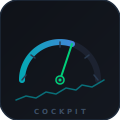
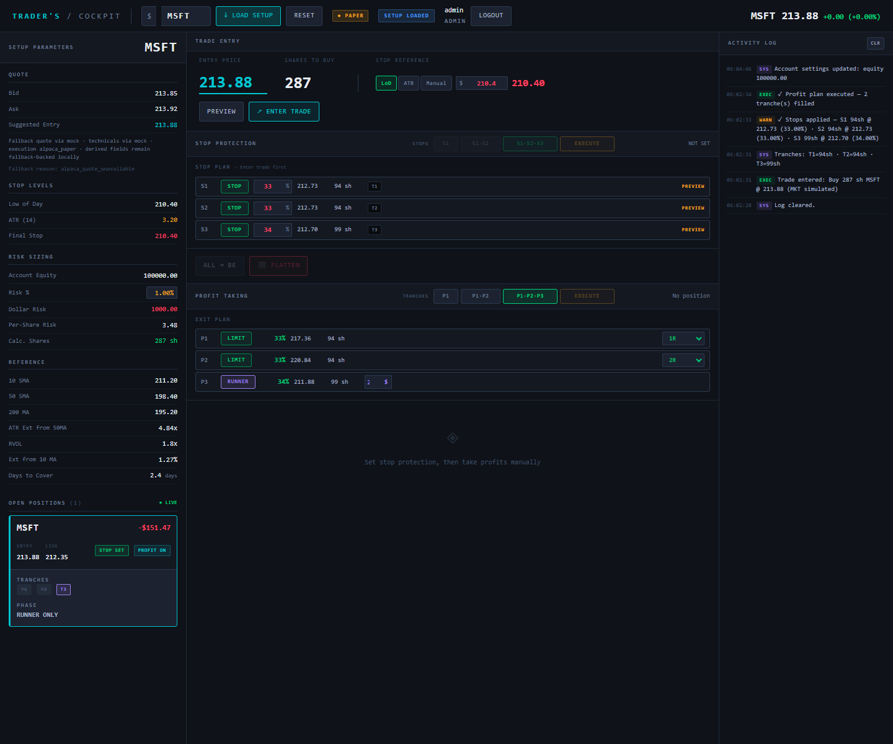
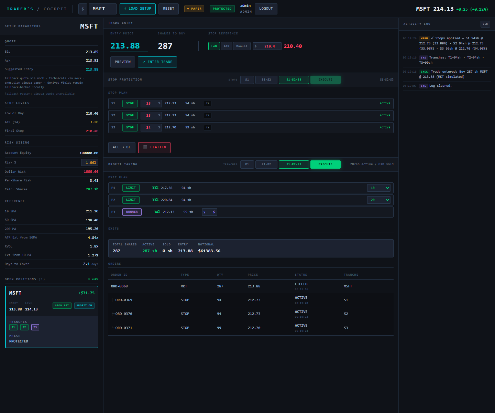
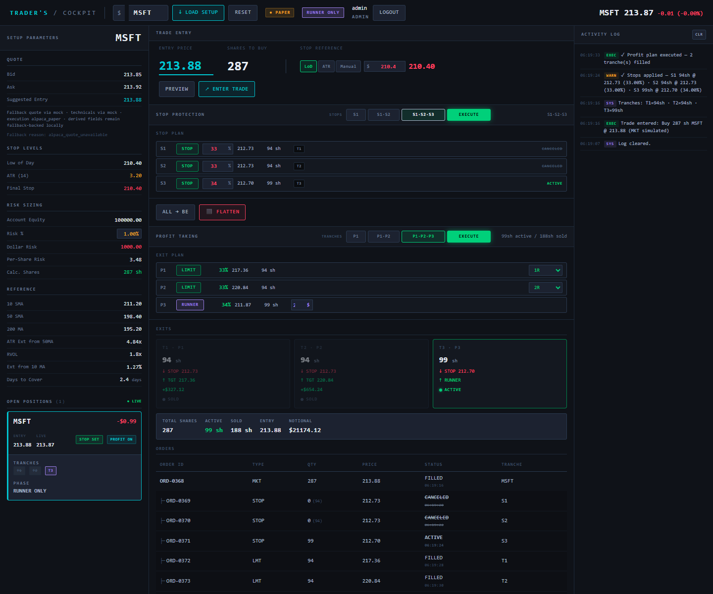

<div align="center">
  

  <h1>Traders Cockpit</h1>

  <p><strong>Open-source swing trade management terminal.</strong><br/>
  Structured risk sizing | Server-side order lifecycle | Real-time position control.</p>

  <p>
    
    
    
    
    
    
  </p>

  <p>
    <a href="#what-is-traders-cockpit">What Is Traders Cockpit?</a> |
    <a href="#features">Features</a> |
    <a href="#the-interface">The Interface</a> |
    <a href="#quick-start">Quick Start</a> |
    <a href="#architecture">Architecture</a> |
    <a href="#configuration">Configuration</a>
  </p>
</div>

---

## What Is Traders Cockpit?

Traders Cockpit is an open-source, full-stack swing trade management terminal. It gives you a structured, server-side workflow for planning trades, sizing positions, managing stop ladders, and executing tranche-based profit plans in a single dark, keyboard-driven UI.

Unlike a spreadsheet or a broker default interface, Traders Cockpit enforces a disciplined, repeatable process:

- You define your risk per trade, and the system sizes the position for you.
- Stops and profit targets are calculated server-side and stored as a parent-child order tree.
- Every meaningful action is written to a durable audit trail and fanned out over WebSocket.
- Live trading stays off unless configuration explicitly enables it.

It is built for traders who want the control of a custom workflow without building one from scratch.

## Features

| Feature | Details |
|---|---|
| Server-side risk sizing | Equity x risk percent / per-share risk. No spreadsheet math at the point of entry. |
| Structured stop ladder | Configure 1, 2, or 3 independent stop groups per position. |
| Tranche profit plans | Sell in up to 3 tranches at 1R, 2R, 3R, or manual targets. |
| Runner management | Keep the last tranche as a runner with a trailing stop. |
| Real-time updates | Price, order, position, and activity-log events stream over `WS /ws/cockpit`. |
| Session auth | Cookie-backed login with seeded admin and trader users for local environments. |
| Safety guardrails | Max notional, daily loss, max-open-position, and duplicate-order protections are enforced server-side. |
| Durable audit log | Entry, stops, profit execution, and flatten actions are persisted and broadcast. |
| Broker modes | Deterministic `paper`, `alpaca_paper`, and gated `alpaca_live` modes. |
| Docker-first local runtime | Full stack on localhost with one compose command. |

## The Interface

The UI is a dark terminal-style cockpit built with Next.js, Tailwind CSS, and IBM Plex Mono. It is designed to stay dense and legible while keeping the whole trade lifecycle on one screen.

```text
+---------------------------------------------------------------------+
|  TRADERS COCKPIT   [$ AAPL >]  [LOAD]  [RESET]   $187.42  +1.3%     |
|  ------------------------------------------------------------- PAPER |
+------------------+---------------------------+----------------------+
|  SETUP           |  ENTRY PANEL              |  ACTIVITY LOG        |
|  ------------    |  --------------------     |  ------------------  |
|  Bid    187.38   |  Entry Price:  187.42     |  09:32 [EXEC]        |
|  Ask    187.46   |  Stop Ref:     LOD        |  Buy 53sh AAPL       |
|  Last   187.42   |  Stop Price:   184.10     |  @ 187.42 (MKT)      |
|  LOD    184.10   |  Per-share R:  $3.32      |                      |
|  HOD    189.20   |  Shares:       53         |  09:32 [SYS]         |
|  ATR14  3.45     |  Dollar Risk:  $176       |  T1=18sh T2=18sh     |
|                  |  --------------------     |  T3=17sh             |
|  R1     190.74   |  Tranches: 1  2  3        |                      |
|  R2     194.06   |                           |  09:31 [SYS]         |
|  R3     197.38   |  [PREVIEW] [ENTER TRADE]  |  Cockpit initialized |
|                  +---------------------------+                      |
|  POSITIONS       |  STOP PROTECTION          |                      |
|  ------------    |  --------------------     |                      |
|  o AAPL  PROT    |  Mode: 1  2  3            |                      |
|                  |  S1 100%  S2 50%  S3 33%  |                      |
|                  |                           |                      |
|                  |  [EXECUTE STOPS] [-> BE]  |                      |
|                  |  [FLATTEN]                |                      |
|                  +---------------------------+                      |
|                  |  PROFIT TAKING            |                      |
|                  |  --------------------     |                      |
|                  |  T1: 18sh -> 1R           |                      |
|                  |  T2: 18sh -> 2R           |                      |
|                  |  T3: 17sh -> RUNNER       |                      |
|                  |                           |                      |
|                  |  [EXECUTE PROFIT PLAN]    |                      |
+------------------+---------------------------+----------------------+
```

Panels:

- Setup: quote data, session state, reference levels, computed R-levels, and active positions.
- Entry Panel: choose entry, stop reference, preview size, and submit the trade.
- Stop Protection: define stop groups, execute protection, move to breakeven, or flatten.
- Profit Taking: configure tranche targets and the runner stop.
- Activity Log: live scrolling audit trail with tags such as `EXEC`, `SYS`, `WARN`, and `CLOSE`.

### Current UI Baselines







## Quick Start

### Option 1 - Docker (recommended)

Bring up the full stack on localhost.

```bash
git clone https://github.com/Melvinroy/traders-cockpit.git
cd traders-cockpit

cp .env.example .env
docker compose --env-file .env up --build -d
```

| Service | URL |
|---|---|
| Frontend | http://127.0.0.1:3000 |
| Backend API | http://127.0.0.1:8000 |
| API Docs | http://127.0.0.1:8000/docs |
| PostgreSQL | localhost:55432 |
| Redis | localhost:56379 |

Default login: `admin` / `change-me-admin`

- `.env.example` is the deterministic local-dev contract
- `.env.production.example` is the hosted staging/production contract
- `.env.personal-paper.example` is for private local Alpaca paper trading
- `.env.example`, `.env.personal-paper.example`, `.env.production.example`, and `docker-compose.yml` use `change-me-*` placeholder passwords
- override all placeholder credentials in any real environment

Rotate all seeded credentials before any shared or hosted deployment.

### Option 2 - Local personal-paper profile

Run the frontend and backend locally while Postgres and Redis stay on localhost. This is the branch's current non-Docker paper-trading path.

```powershell
Copy-Item .env.personal-paper.example .env.personal-paper.local
# Edit .env.personal-paper.local and add your Alpaca paper credentials

.\scripts\dev\start-local-personal-paper.ps1
```

| Service | URL |
|---|---|
| Frontend | http://127.0.0.1:3010 |
| Backend API | http://127.0.0.1:8010 |
| PostgreSQL | localhost:55432 |
| Redis | localhost:56379 |

To stop the local stack:

```powershell
.\scripts\dev\stop-local.ps1
```

### Option 3 - Manual

Backend:

```bash
cd backend
python -m venv .venv
# Windows PowerShell
. .venv/Scripts/Activate.ps1
pip install -e .[dev]
alembic upgrade head
uvicorn app.main:app --reload --host 0.0.0.0 --port 8000
```

Frontend:

```bash
cd frontend
npm install
npm run dev
```

Manual startup requires PostgreSQL on `55432` and Redis on `56379`. If you are not using the repo scripts, set `DATABASE_URL` and `REDIS_URL` first.

### Deterministic dev and QC path

For the repo-owned deterministic development flow, use the local paper runtime with controller mock enabled:

```powershell
.\scripts\dev\start-local.ps1
```

This path uses `.env.example`, defaults `BROKER_MODE=paper`, and is the baseline for automated QC.

## Architecture

```text
User Browser
     |  REST (HTTP) / WebSocket (ws://)
     v
+-------------+                +----------------------+
|  Next.js    | ---- REST ---> |  FastAPI Backend     |
|  Frontend   | <---- WS ----- |  Python / Uvicorn    |
|  :3010 dev  |                +----------+-----------+
+-------------+                           |
                                +---------+---------+
                                |                   |
                           +----v-----+       +-----v----+
                           | Postgres |       |  Redis   |
                           |  :55432  |       |  :56379  |
                           +----------+       +----------+
                                                      |
                                                +-----v------+
                                                | Alpaca API |
                                                | paper/live |
                                                +------------+
```

| Layer | Technology |
|---|---|
| Frontend | Next.js 15, React 19, TypeScript, Tailwind CSS |
| Backend | FastAPI, SQLAlchemy 2, Alembic, Pydantic v2 |
| Database | PostgreSQL 16, with SQLite fallback available when explicitly enabled |
| Realtime | WebSocket with Redis pub/sub fanout and single-process fallback |
| Broker | `paper`, `alpaca_paper`, `alpaca_live` |
| Auth | Cookie-based session auth backed by `AUTH_STORAGE_MODE` (`file` locally, `database` hosted) |
| Infra | Docker Compose locally, Render blueprint for hosted backend |

Key backend layers:

- `app/api/` — Route handlers (auth, account, market, positions, trade)
- `app/services/cockpit.py` — All business logic: sizing, lifecycle, order hierarchy, safety checks
- `app/adapters/broker.py` — `PaperBrokerAdapter` (sim) and `AlpacaBrokerAdapter` (real execution)
- `app/adapters/market_data.py` — Alpaca/Polygon quotes with deterministic fallback
- `app/ws/manager.py` — Redis pub/sub fanout with single-process fallback
- `scripts/dev/rebuild_position_projections.py` — rebuild projection payloads from current backend state
- `scripts/dev/check_broker_paper_drift.py` — compare local broker-paper state with broker order truth and emit a pass/fail summary

For a fuller breakdown, see [docs/architecture/OVERVIEW.md](docs/architecture/OVERVIEW.md).

## Trade Lifecycle

Every position moves through a server-side phase model:

```text
idle
  -> setup_loaded   (ticker loaded, setup computed)
  -> entry_pending  (market closed; order accepted and queued)
  -> trade_entered  (entry order filled, tranches created)
  -> protected      (stop orders active)
  -> P1_done        (first profit tranche executed)
  -> P2_done        (second profit tranche executed)
  -> runner_only    (runner remains with trailing management)
  -> closed         (all tranches exited or flattened)
```

Notes:

- `entry_pending` is real behavior in off-hours flows; the backend queues the entry for the next regular session.
- Active phases in the UI are `setup_loaded`, `entry_pending`, `trade_entered`, `protected`, `P1_done`, `P2_done`, `runner_only`, and `closed`.

Order hierarchy example:

```text
ORD-0001  MKT    AAPL  53sh              FILLED   <- root entry
|- ORD-0002  STOP   18sh @ 184.10        ACTIVE   <- stop group S1
|- ORD-0003  STOP   35sh @ 185.50        ACTIVE   <- stop group S2
|- ORD-0004  LIMIT  18sh @ 190.74        FILLED   <- T1 at 1R
|- ORD-0005  LIMIT  18sh @ 194.06        FILLED   <- T2 at 2R
\- ORD-0006  TRAIL  17sh trail $2.00     ACTIVE   <- runner
```

## Configuration

Copy `.env.example` to `.env` for deterministic local development. Use `.env.production.example` as the hosted staging/production starting point. Most values have safe local defaults in development and intentionally stricter defaults in the production template.

### Core and connectivity

| Variable | Default | Description |
|---|---|---|
| `APP_ENV` | `development` | Runtime environment. |
| `APP_DEFAULT_ROLE` | `admin` | Default app role when override is enabled. |
| `APP_ALLOW_ROLE_OVERRIDE` | `true` | Allows local role switching when supported. |
| `OPS_REQUIRE_AUTH` | `false` | Gates ops endpoints behind auth checks when enabled. |
| `NEXT_PUBLIC_API_BASE_URL` | `http://127.0.0.1:8010` | Frontend REST origin for local script-driven dev. |
| `NEXT_PUBLIC_WS_URL` | `ws://127.0.0.1:8010/ws/cockpit` | Frontend websocket origin for local script-driven dev. |
| `CORS_ORIGINS` | `http://127.0.0.1:3000,http://localhost:3000,http://127.0.0.1:3010,http://localhost:3010` | Allowed browser origins. |
| `DATABASE_URL` | `postgresql://<db-user>:<db-password>@<db-host>:5432/<db-name>` | PostgreSQL connection string. |
| `REDIS_URL` | `redis://<redis-host>:6379/0` | Redis connection string. |
| `REDIS_CHANNEL_PREFIX` | `traders-cockpit` | Prefix for websocket pub/sub fanout. |
| `ALLOW_SQLITE_FALLBACK` | `false` | Enables SQLite trading-data fallback explicitly. |
| `SQLITE_FALLBACK_URL` | `sqlite:///./data/traders_cockpit.db` | SQLite DSN when fallback is enabled. |

### Auth

| Variable | Default | Description |
|---|---|---|
| `AUTH_REQUIRE_LOGIN` | `true` | Enforce login before access |
| `AUTH_ADMIN_USERNAME` | `admin` | Admin account username |
| `AUTH_ADMIN_PASSWORD` | `change-me-admin` | **Change this in production** |
| `AUTH_TRADER_USERNAME` | `trader` | Trader account username |
| `AUTH_SESSION_TTL_HOURS` | `24` | Session cookie lifetime |
| `AUTH_COOKIE_SAMESITE` | `lax` | Set `none` for cross-origin hosted deployments |
| `AUTH_COOKIE_SECURE` | `false` | Set `true` in staging/production |

### Broker and market data

| Variable | Default | Description |
|---|---|---|
| `BROKER_MODE` | `paper` | Default local mode in `.env.example`. |
| `ALLOW_LIVE_TRADING` | `false` | Master kill switch for live execution. |
| `ALLOW_CONTROLLER_MOCK` | `true` | Allows deterministic local fills when not using real Alpaca paper. |
| `LIVE_CONFIRMATION_TOKEN` | empty | Required before `alpaca_live` becomes effective. |
| `ALPACA_API_KEY_ID` | empty | Alpaca paper or live API key. |
| `ALPACA_API_SECRET_KEY` | empty | Alpaca paper or live secret. |
| `ALPACA_API_BASE_URL` | `https://paper-api.alpaca.markets` | Paper trading base URL. |
| `ALPACA_LIVE_API_BASE_URL` | `https://api.alpaca.markets` | Live trading base URL. |
| `ALPACA_DATA_BASE_URL` | `https://data.alpaca.markets` | Alpaca market data URL. |
| `MASSIVE_API_KEY` | empty | Massive/Polygon-compatible data API key. |
| `MASSIVE_API_BASE_URL` | `https://api.polygon.io` | Massive data API URL. |
| `POLYGON_API_KEY` | empty | Polygon API key. |
| `POLYGON_API_BASE_URL` | `https://api.polygon.io` | Polygon API URL. |

### Risk and ops

| Variable | Default | Description |
|---|---|---|
| `DEFAULT_ACCOUNT_EQUITY` | `100000` | Starting equity for local account state. |
| `DEFAULT_RISK_PCT` | `1` | Default risk per trade. |
| `MAX_POSITION_NOTIONAL_PCT` | `100` | Max position notional as percent of equity. |
| `DAILY_LOSS_LIMIT_PCT` | `2` | Daily loss guardrail. |
| `MAX_OPEN_POSITIONS` | `6` | Max concurrent open positions. |
| `OPS_API_KEY` | empty | Optional ops API key. |
| `OPS_ADMIN_API_KEY` | empty | Optional elevated ops API key. |
| `OPS_SIGNING_SECRET` | empty | Optional signing secret for ops integrations. |

## Broker Modes

| Mode | Execution | Typical use |
|---|---|---|
| `paper` | Deterministic simulated fills | Local development, tests, QC. |
| `alpaca_paper` | Alpaca paper account | Local paper trading with real broker semantics. |
| `alpaca_live` | Alpaca live account | Real-money execution, still gated by explicit opt-in. |

Important:

- `.env.example` defaults to `BROKER_MODE=paper` for deterministic local work.
- `docker-compose.yml` defaults the backend container to `BROKER_MODE=paper`.
- `alpaca_live` remains inactive unless `BROKER_MODE=alpaca_live`, `ALLOW_LIVE_TRADING=true`, and `LIVE_CONFIRMATION_TOKEN` are all set.

## Testing

Backend:

```bash
cd backend
ruff check .
black --check .
pytest -q
```

Frontend:

```bash
cd frontend
npm run lint
npm run typecheck
npm run test
npm run build
```

Full local QC:

```powershell
.\scripts\dev\run-qc.ps1 -StartStack
```

QC artifacts are written under `frontend/output/playwright/` and are expected to include:

- `baseline-idle.png`
- `baseline-setup-loaded.png`
- `baseline-trade-entered.png`
- `baseline-protected.png`
- `baseline-profit-flow.png`

## Deployment

Recommended hosted topology:

| Service | Host |
|---|---|
| Frontend | Vercel |
| Backend | Render or another Docker-capable host |
| Database | Managed PostgreSQL |
| Cache | Managed Redis |

Canonical hosted origins:

- Frontend: `https://app.example.com`
- Backend API: `https://api.example.com`
- Backend WebSocket: `wss://api.example.com/ws/cockpit`

The repo includes [render.yaml](render.yaml) for backend, Postgres, and Redis provisioning on Render.

For hosted deployments, start from `.env.production.example` and validate the env file before deploy:

```powershell
Copy-Item .env.production.example .env.production.local
.\scripts\dev\check-hosted-env.ps1 -EnvFile ".env.production.local"
```

For hosted cross-origin deployments:

```env
AUTH_COOKIE_SAMESITE=none
AUTH_COOKIE_SECURE=true
AUTH_STORAGE_MODE=database
CORS_ORIGINS=https://your-frontend.vercel.app
```

Validate hosted envs before deploy:

```powershell
.\scripts\dev\check-hosted-env.ps1 -EnvFile ".env"
```

Hosted browser smoke:

```powershell
.\scripts\dev\run-hosted-smoke.ps1 `
  -FrontendUrl "https://app.example.com" `
  -BackendUrl "https://api.example.com" `
  -EnvFile ".env.production.local"
```

For local validation of the hosted smoke wrapper, add explicit auth overrides:

```powershell
.\scripts\dev\run-hosted-smoke.ps1 `
  -FrontendUrl "http://127.0.0.1:3094" `
  -BackendUrl "http://127.0.0.1:8094" `
  -EnvFile ".env.production.example" `
  -AuthUsername "admin" `
  -AuthPassword "change-me-admin"
```

More deployment detail lives in [docs/process/HOSTED_DEPLOYMENT.md](docs/process/HOSTED_DEPLOYMENT.md).

Backend health strategy for hosted deployments:

- `GET /health/live`: process liveness
- `GET /health/ready`: readiness including runtime contract and hosted dependency checks
- `GET /health/deps`: structured dependency detail for auth storage, Postgres, and Redis

## Roadmap

- Broker reconciliation against Alpaca paper fills.
- Richer technical overlays and provider-backed indicators.
- Position snapshots for post-trade review.
- Multi-instance Redis hardening for hosted fanout.
- Richer audit exports with tranche PnL and slippage context.
- Expanded browser smoke and lifecycle coverage.

## Contributing

This repo uses an issue-first, PR-first staged workflow.

1. Create or link an issue.
2. Branch from `codex/integration-app`.
3. Use a scoped `codex/feature-*`, `codex/bugfix-*`, or `codex/refactor-*` branch.
4. Run the appropriate validation path before review.
5. Open a PR into `codex/integration-app`.
6. Promote to `main` only through the separate promotion flow.

Canonical process docs:

- [docs/process/WORKFLOW.md](docs/process/WORKFLOW.md)
- [docs/process/BRANCH_PROTECTION.md](docs/process/BRANCH_PROTECTION.md)
- [docs/process/RELEASE_PROMOTION_CHECKLIST.md](docs/process/RELEASE_PROMOTION_CHECKLIST.md)
- [docs/process/STAGING_RELEASE_PLAYBOOK.md](docs/process/STAGING_RELEASE_PLAYBOOK.md)
- [docs/process/SECRET_ROTATION_RUNBOOK.md](docs/process/SECRET_ROTATION_RUNBOOK.md)

## License

[MIT](LICENSE) - free to use, fork, and build on.

---

<div align="center">
  <sub>
    <a href="docs/architecture/OVERVIEW.md">Architecture</a> |
    <a href="docs/process/WORKFLOW.md">Workflow</a> |
    <a href="docs/process/HOSTED_DEPLOYMENT.md">Deployment</a>
  </sub>
</div>
